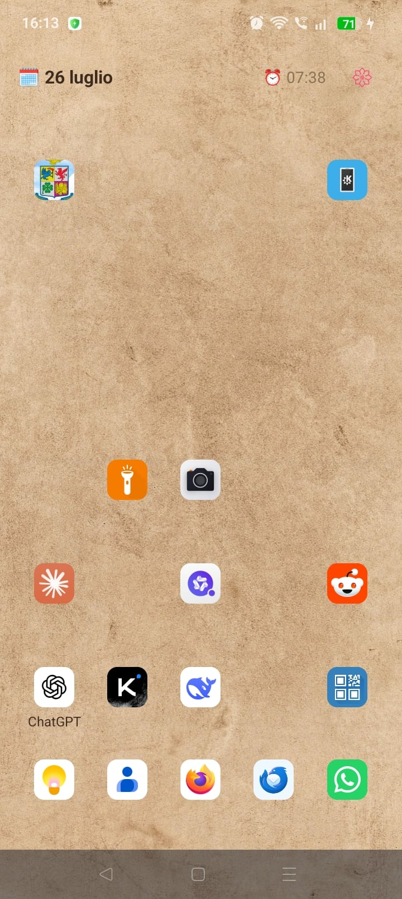
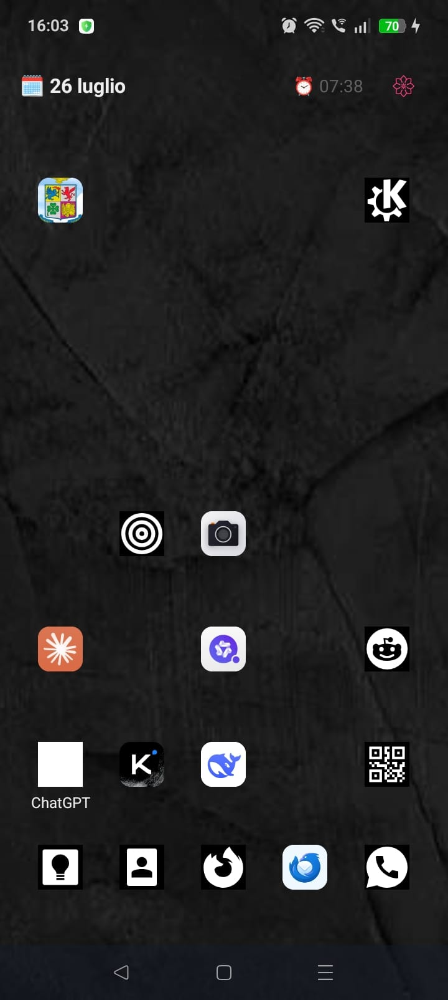
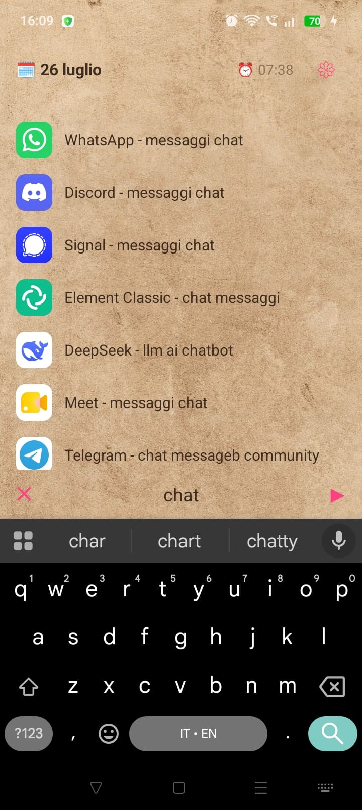
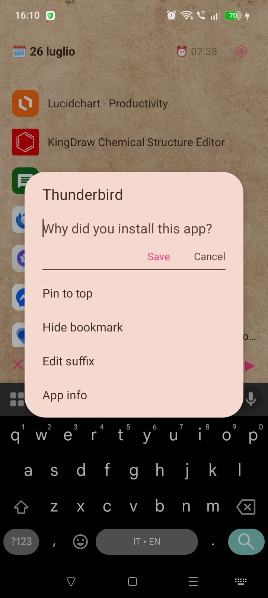
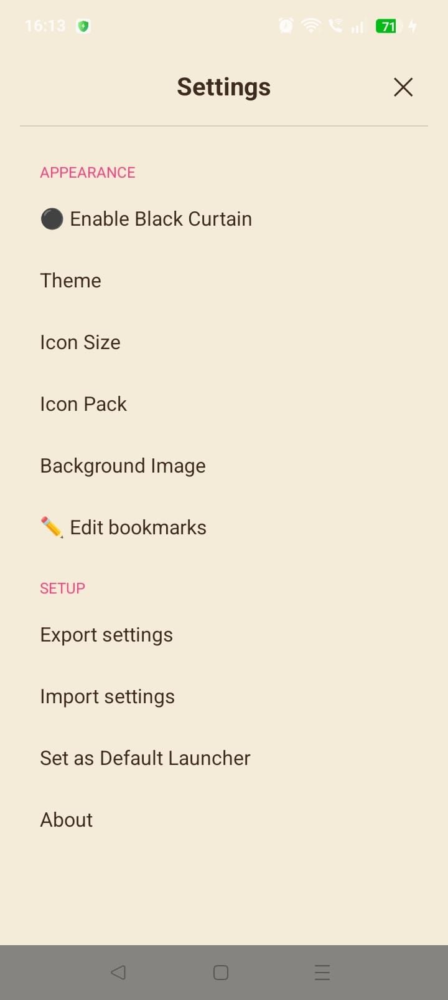
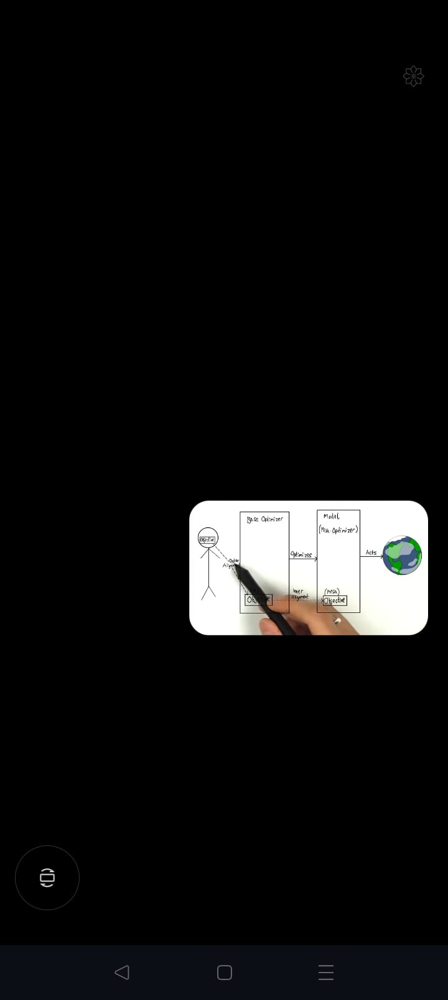
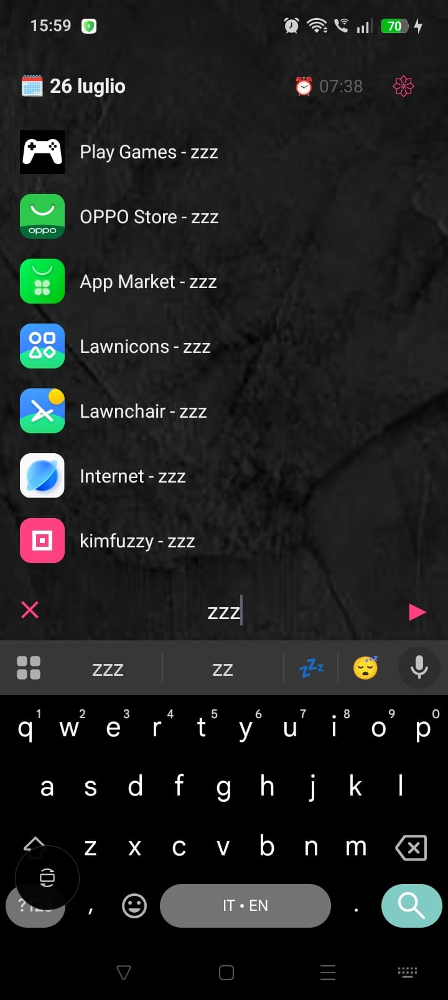

= KimFuzzy
:toc: left
:toclevels: 2
:icons: font
:sectanchors:

A minimal, fast Android launcher with fuzzy search, bookmark grid, and distraction-free mode.

image:https://img.shields.io/badge/license-LGPL%20v3-blue.svg[License, link=https://www.gnu.org/licenses/lgpl-3.0.html]
image:https://img.shields.io/badge/Android-8.0%2B-green.svg[Android, link=https://developer.android.com]

== Features

* *Fuzzy search* — Find apps instantly with a fzf-inspired scoring algorithm. Multi-word queries supported.
* *Bookmark grid* — Pin favorite apps to a bottom grid. Drag-to-reorder in edit mode.
* *App annotations* — Add personal notes to apps so you remember why you installed them.
* *Custom suffixes* — Label apps manually (e.g., "Finance - LLM AI").
* *Hidden apps* — Set an app's suffix to "zzz" (via *Edit suffix*) to bury it from normal search results; type "zzz" anywhere in a query to bring every hidden app back into view.
* *Icon pack support* — Load any standard Android icon pack (Nova/ADW/Tesla/etc. themes), set independently per theme.
* *Themes* — Light (warm sepia-inspired palette) and Dark modes with independent wallpaper and icon pack buckets.
* *Black Curtain* — Opaque overlay for distraction-free PiP video watching.
* *Background images* — Per-theme wallpapers that fill the screen edge-to-edge.
* *Settings export/import* — Back up and restore your configuration as JSON.
* *Pinned apps* — Keep chosen apps at the top of search results.
* *Launch tracking* — Recently used apps sort higher in search.
* *Shortcut support* — Pin dynamic shortcuts from apps directly to bookmarks.

== Screenshots

*Light mode* — a warm, sepia-inspired palette for daytime use.

*Dark mode* — a low-glare palette for night use.

*Filter/search* — fuzzy-search all installed apps and shortcuts as you type.

*App annotation* — jot down why you installed an app, so future-you remembers.

*Settings* — appearance, bookmarks, and setup options in one full-screen view.

*Black Curtain* — an opaque overlay for distraction-free PiP video watching.

*Hidden apps* — type "zzz" to reveal apps you've buried from normal search results.

== Build

[source,bash]
----
./gradlew assembleDebug
----

Requires **Android SDK 34** and **Kotlin 1.9+**.

== Install

[source,bash]
----
adb install -r app/build/outputs/apk/debug/app-debug.apk
----

Then open *Settings → Set as Default Launcher* inside the app.

== Usage

* *Swipe up* on the bookmark grid to open search.
* *Type* to filter apps. Tap the ▶ button or press Enter to launch the top result.
* *Long-press* a bookmark for options (rename, annotate, hide).
* *Long-press* a search result for options (pin, bookmark, edit suffix, app info).
* *Tap 𑁍* to open settings.
* *Tap ✏️* in settings to enter bookmark edit mode (drag to reorder, drag to 🗑️ to hide).

== Architecture

[source]
----
MainActivity.kt          — Activity lifecycle, window insets, intent handling
TopBar.kt                — Date, time, next alarm display
Bookmarks.kt             — Grid layout, drag-and-drop, touch handling
AppSearch.kt             — RecyclerView filter, app launching, app options dialog
AppLoading.kt            — PackageManager scan, icon resolution, caching
AppCache.kt              — Disk cache for app metadata + icon bitmaps
IconPack.kt              — appfilter.xml parser for third-party icon packs
FzfScorer.kt             — Fuzzy matching algorithm
ThemeUtils.kt            — Light / Dark color resolution
Prefs.kt                 — SharedPreferences wrapper + JSON export/import
SettingsDialogs.kt       — Settings UI builders
BlackCurtain.kt          — Distraction-free overlay
----

== License

This program is free software: you can redistribute it and/or modify it under the terms of the GNU Lesser General Public License as published by the Free Software Foundation, either version 3 of the License, or (at your option) any later version.

See link:LICENSE[LICENSE] or https://www.gnu.org/licenses/lgpl-3.0.html for the full text.
